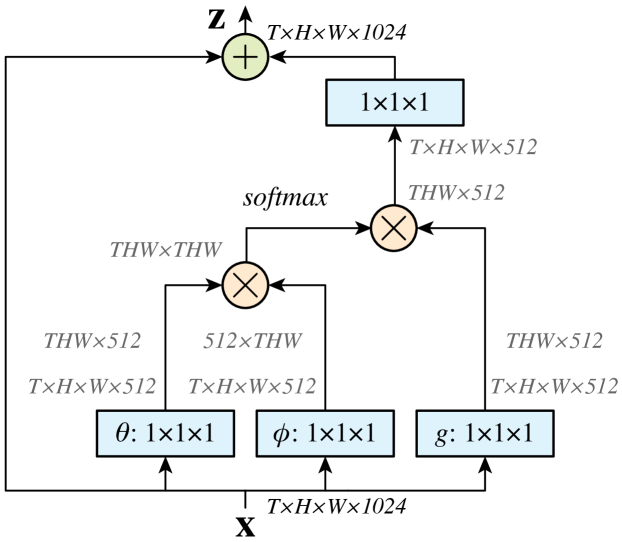

# Non-local operation

# 소개

컨볼루션 연산이나 재귀 연산은 입력의 전체가 아닌 부분 부분을 처리한다.

non-local 연산은 한번에 입력 전체를 처리하는 연산이다.

## 장거리 의존성

장거리 의존성은 멀리 떨어져 있는 데이터들의 관계성이다.

이 값이 높으면 서로 관계가 있는 데이터라는 의미이다.

# Non-local operation 그림

> *그림 출처: Wang et al., "Non-local Neural Networks", CVPR 2018*

* X : 입력 데이터
* ⊗ : 행렬 곱
* ⊕ : 원소별 합

처음에 X는 channel이 1024인 상태로 들어온다. (여기서 1024는 예시이다. 다른 크기도 가능하다.)

이때 가중치 $W_θ$와 $W_ϕ$를 지나고 나서는 channel이 512로 줄어든다. 이는 bottleneck에서 가져온 것이다.

channel이 줄어드니 계산량은 절반으로 줄어든다.

이는 g에서도 마찬가지이다.

# 식

non-local operation을 식으로 쓰면 다음과 같다.

1. $θ(x_i)=W_θx_i$

2. $ϕ(𝐱_j)=W_ϕx_j$

3. $f(x_i, x_j)=e^{θ(x_i)^Tϕ(𝐱_j)}.$

4. $𝒞(x)=\sum\limits_{\forall j} f(x_i, x_j)$

5. $\mathbf{y_i} = \frac{1}{\mathcal{C}(\mathbf{x})} \sum\limits_{\forall j} f(\mathbf{x}_i, \mathbf{x}_j)g(\mathbf{x}_j)$

6. $g(x_j)=W_gx_j$

7. $z_i = W_zy_i + x_i$

# 식 설명

## 들어오는 데이터 (Input)

일단 이 non_local은 모델의 초반에 들어가는것이 아닌 뒷부분, 즉 여러 feature를 뽑아내고 나서 들어간다.

입력으로 들어오는 채널이 1024라고 한다면 현재 1024개의 feature를 뽑아냈다는 의미이다.

지금의 feature는 서로 간의 관계가 약한 상태이다. 

non_local은 서로의 장거리 의존성을 추가해준다.

## 식 1번, 2번

식 1번과 2번은 1024채널을 512로 줄여서 계산량을 낮춰준다

## 식 3번 

식 3번은 식 1번과 2번에서 구한 값들을 행렬 곱함으로서 서로의 관계를 하나의 값으로 나타내는 것이다.

## 식 4번

그 후 지수 함수에 넣어주고 이들의 합을 분모로 삼아줌으로서 

서로간의 관계를 하나의 값으로 나타냈던걸 확률로 변환시켜준다. 이들이 얼마나 가까운지에 대한 확률이다.

softmax라 생각하면 된다.

## 식 6번 

g함수는 데이터의 특징이다. 이 특징이 얼마나 높은지 이다. 확실한 특징이 있나이다.

* g가 높고 f가 높음 : 확실한 특징이 있고 이것이 나와 관련 있다 -> 정보를 많이 가져온다.

* g가 높고 f가 낮음 : 확실한 특징은 있지만 이것이 나와 관련은 없다 -> 정보를 조금 가져온다.

* g가 낮고 f가 높음 : 확실한 특징은 없지만 (특징이 미미하다) 나와 관련이 있다 -> 정보를 약하게 가져온다.

* g가 낮고 f가 낮음 :  확실한 특징도 없고 나와 관련도 없다 -> 무시한다.

위의 4가지를 계산하는 것이 식 5번이다.

## 식 5번

식 5번은 모든것을 합친 것이다.

서로가 관련 있는 확률 * 현재 데이터의 특징의 강도 를 나타낸다.

## 식 7번

마지막으로 식 5번에서 나온 값을 $W_z$와 계산해줌으로 다시 채널을 올려주고

원래 데이터와 원소별 합을 구해준다.

이러면 원래 데이터 + 서로 어느정도 관련이 있는지 이것이 계산된다.

입력 데이터는 자기 자신만의 값을 갖고 있던 데이터라면

출력 데이터는 자기 자신만의 값 + 다른 위치에 있는 데이터와의 관계 를 가진 데이터이다.

# 효과

장거리 의존성을 파악한다는 것은 전체를 본다는 것이다.

이미지에서는 전체 픽셀들의 관계를 본다는 것이고, 글에서는 전체 문맥을 본다는 것이다.

기존의 CNN이나 재귀의 경우에는 장거리 의존성을 파악하려면 레이어를 깊게 쌓아야 했다.

이렇게 되면 계산량이 늘어나고, 기울기 소실또한 일어나는 문제가 있었다.

non-local operatoin은 장거리 의존성을 한번에 파악함으로서 이러한 문제를 해결해준다.

---
## 참고 문헌 (References)
* **Paper**: Wang, X., Girshick, R., Gupta, A., & He, K. (2018). [Non-local Neural Networks](https://arxiv.org/abs/1711.07971). *Proceedings of the IEEE conference on computer vision and pattern recognition*.
