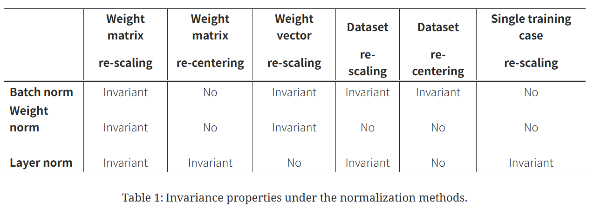

특정 latex가 깨지는 문제가 있음. 여러가지를 해보건데 \begin{bmatrix}부분이 이상한것으로 예상됨

정확한 해결 방법을 찾을때까진 일단 대기할 생각

# 1. 소개

RNN에서 배치 정규화를 적용하는 경우에는 다음과 같은 단점이 존재한다..

1. 입력의 크기가 바뀌면 적용이 힘들다.
2. 미니배치가 작은 경우에는 적용이 힘들다.
3. 테스트에서 사용하기 위해 학습에서 계산한 평균과 표준편차들을 저장해야한다.

Layer Normalization은 이 모든 단점을 극복한 새로운 정규화 방식이다.

이를 통해 RNN에서도 정규화를 적용해 깊은 층을 쌓을 수 있게 되었다.

# 2. 배치 정규화 간단설명

## 2.1 레이어 출력값

먼저 기본 선형 레이어가 출력하는 값을 봐보자.

### 2.1.1 가중치 X 입력값

$a_i^l=w_i^{l\top}h^l$

$w_i^l$은 l번째 hidden layer의 i번 가중치이다.

$h^l$은 l번째 hidden layer에 들어오는 입력이다.

$a_i^l$은 l번째 hidden layer의 출력값이다. 아직 활성화 함수 (ReLU, 시그모이드 등)은 거치지 않았다.

### 2.1.2 활성화 이후 출력값

$h_i^{l+1}=f(a_i^l+b_i^l)$

$h^{l+1}$은 l+1번째 hidden layer에 들어오는 입력이 된다.

이제 $a_i^l$에다가 l번째 hidden layer의 i번 편향을 더해주고 활성화 함수를 씌어주면 

다음 hidden layer에 전달되는 값이 완성되는 것이다.

## 2.2 발생하는 문제

정규화를 거치지 않았을때 생기는 대표적 문제중 하나가 ‘**공변량 변화**’이다.

### 2.2.1 공변량 변화

간단히 말해, 이전 레이어의 가중치가 바뀌면 다음 레이어에 들어가는 출력값의 분포가 달라진다.

이것이 반복되면 학습이 불안정하게 되는 것이다.

### 2.2.2 예시

아까 들어온 출력값들은 평균이 0이어서 평균이 0인 쪽으로 학습을 했는데

이번에 들어온 출력값들은 가중치가 바뀌어서 평균이 100이 된것이다.

이러면 다시 평균이 100인 쪽으로 학습을 해야하고 이것이 계속 반복되면 학습이 불안정해지는 것이다.

그래서 정규화를 하는 것이다.

## 2.3 배치 정규화 수식

$\bar{a}_i^l=g_i^l\frac{(a_i^l-\mu_i^l)}{\sigma_i^l}$

기존의 $a_i^l$에 평균을 빼고 표준편차로 나눈다. 이렇게 하면 모든 $a$의 평균은 0이 된다.

$\mu_i^l=\mathop{\mathbb{E}}\limits_{{𝕩 \sim P(𝕩)}}[a_i^l]$ 

$\mu$는 평균이다. 평균은 기댓값으로 구한다. 매번 나오는 값이 달라지기 때문에 기댓값으로 구한다.

$\sigma_i^l=\sqrt{\mathop{\mathbb{E}}\limits_{{𝕩 \sim P(𝕩)}} \bigg[(a_i^l-\mu_i^l)^2]} \bigg]$ 

$\sigma$는 표준편차이다. 표준편차도 기댓값으로 구한다.

실제 계산에서는 기댓값이 아닌 같은 미니배치의 같은 인덱스에 있는 데이터들의 평균이다.

앞에 보이는 $g$는 gain 파라미터로 정규화된 $a$의 분산을 늘려준다.

분산을 늘려주지 않으면 표현력이 너무 약해져서 학습이 더디게 된다.

### 2.3.1 배치 정규화의 단점

여기서 배치 정규화의 단점들이 나온다.

본 설명은 RNN을 기준으로 함을 알린다.

1. 테스트에서 사용하기 위해 학습에서 계산한 평균과 표준편차들을 저장해야한다.

수식을 보면 분모가 표준편차이다. 그리고 테스트에서는 하나의 데이터만을 보고 계산을 한다.

하나의 데이터에서는 당연히 표준편차가 0이다. 분모가 0이 되니 계산이 안된다.

그래서 시퀀스의 인덱스마다 평균과 표준편차를 저장해서 사용한다.

1번 단어의 평균과 표준편차를 저장하고

2번 단어의 평균과 표준편차를 저장하고

나중에 테스트를 할때는 저장해둔 평균과 표준편차를 이용하는것이다.

길면 길수록 저장해야하는 평균과 표준편차는 늘어나게된다.

1. 미니배치가 작은 경우에는 적용이 힘들다.

미니 배치 사이즈가 5고 들어온 데이터가

1, 2, 3, 4, 100000000 이라고 해보자. 평균은 20000002이다.

20000002라는 숫자가 위의 데이터를 표현한다고 볼 수 있을까?

미니 배치 사이즈가 작은 경우 위와 같이 평균이 갖는 의미가 희석되어버린다.

1. 입력의 크기(시퀀스의 길이) 가 바뀌면 적용이 힘들다.

학습할때는 길이가 100인 시퀀스가 들어왔는데

테스트에서 길이가 1000인 시퀀스가 들어오면 적용할 수 없다.

저장된 평균과 표준편차가 없어서 정규화를 할 수 없기 때문이다.

이러한 이유들로 배치 정규화는 RNN에 적용 시키는데 어려움이 있었고

Layer normalization이 나오게 된것이다.

# 3. Layer normalization

배치 정규화는 미니배치 내 같은 인덱스의 데이터들의 평균과 표준편차를 구했다.

하지만 Laye normalization은 오직 자신의 데이터만을 통해 정규화를 진행한다.

표준 RNN의 기본 식을 봐보자

## 3.1 표준 RNN 수식

$𝕒^t=W_{hh}h^{t-1}+W_{xh}𝕩^t$

$W_{hh}$는 hidden-to-hidden 가중치이다. 

$W_{xh}$는 input-to-hidden 가중치이다.

$W_{hh}h^{t-1}$은 이전 시점 (t-1)에서 넘어온 데이터에 가중치를 곱한 값이다.

$W_{xh}𝕩^t$는 지금 들어온 데이터에 가중치를 곱한 값이다.

이 둘을 더하면 활성화 함수(sigmoid, ReLU)에 들어가기 전의 값이 나온다.

## 3.2 Layer normalization 수식

먼저 2개의 식을 보자.

### 3.2.1 평균

 $\mu^t=\frac{1}{H}\sum\limits_{i=1}^Ha_i^t$

$\mu^t$는 평균이다. 여기서 t는 시점이다. 

$a_i^t$는 $𝕒^t=W_{hh}h^{t-1}+W_{xh}𝕩^t$이 $a$이다. $a$의 모양은 다르지만 이 $a$이다.

𝕒는 벡터이고 $a$는 스칼라(하나의 숫자)이다. 그래서 $a$는 $a_i$이렇게 밑에 i가 붙는다.

현재 레이어에 들어온 모든 $a$의 평균을 구하면 된다.

### 3.2.2 표준편차

$\sigma^t=\sqrt{\frac{1}{H}\sum\limits_{i=1}^H(a_i^t-\mu^t)^2}$

$\sigma^t$는 표준편차이다. 여기서 t는 시점이다.

$a$와 $\mu$는 위에서 구한것이다. 둘을 뺀 값의 제곱의 평균에 루트의 씌우면 된다.

### 3.2.3 Layer normalization

$𝕙^t=f\left[\frac{𝕘}{\sigma^t}⊙(𝕒^t-\mu^t)+𝕓 \right]$

논문에는 이렇게 나와있지만

$𝕙^t=f\left[𝕘⊙\frac{(𝕒^t-\mu^t)}{\sigma^t}+𝕓 \right]$

곱셈의 결합법칙에 의해 위와 같이 바꿀 수 있다.

⊙는 두 벡터간 원소별 곱이다. 

𝕓와 𝕘는 $𝕙^t$와 같은 차원의 편향과 gain 파라미터이다.

$\frac{(𝕒^t-\mu^t)}{\sigma^t}$는 평균이 0이고 분산이 1인 정규화된 $a$이다.

여기에 𝕘를 곱하고 𝕓를 더해줘서 표현력을 높여준다.

### 3.2.4 𝕓와 𝕘 적용 이유

굳이 𝕓와 𝕘를 적용시켜주는 이유는 활성화 함수를 생각하면 된다.

sigmoid의 경우 평균이 0이고 분산이 1이면 0에 몰려있다는 것이고

sigmoid함수의 0부분을 보면 사실상 완만한 직선의 형태이다. 결국 비선형 함수의 의미가 사라지는 것이다.

RelU의 경우 데이터의 절반은 음수가 절반은 양수이 매번 데이터의 0이 되어 사라진다.

위와 같은 이유로 𝕓와 𝕘를 이용해 데이터들을 살려주는 것이다.

어쩌면 𝕓와 𝕘이 없는게 좋을수있다. 이런 경우 𝕓와 𝕘 스스로가 학습해나아가며 0과 1로 수렴하게 될것이다.

# 4. 분석

분석 부분은 굳이 볼 필요는 없다라 생각한다. 솔직히 보면 정신이 나갈 것 같다.

최대한 간단하게 설명하려 노력은 했지만 그럼에도 정신이 나갈 것 같다. 

뭘라도 사용하는데 큰 지장은 없을 거라 생각하고 위에 부분만 봐도 될것이다.

최대한 간단하게 적으려 노력했음을 다시 알리며 분석을 시작하겠다.

---

크게 보면 두가지를 증명한다.

“가중치가 커져도 아무런 상관이 없다”와 “가중치가 커지면 오히려 학습을 더 조심스럽게 한다”이다.

먼저 다른 정규화 방식의 불변성을 탐구한다.

여기서 불변성은 입력 조건이 바뀌어도 결과값은 바뀌지 않고 일정하게 유지되는 성질이다.

간단히 말해 이전 레이어의 가중치가 바뀌어도 현재 레이어에 들어오는 데이터는 변하지 않는 것이다.

## 4.1 가중치와 데이터 변화에 따른 불변성

해당 표는 배치 정규화, 가중치 정규화, 레이어 정규화, 세가지 정규화 방법에 대한 불변성을 보여준다.

가중치 정규화는 다른건 아니고 가중치 벡터의 크기는 1로 만들고 방향만 남기는 것이다.

가중치 벡터의 길이는 $||w||_2 = \sqrt{w_1^2 + w_2^2 + \dots + w_n^2}$를 통해서 구하고

 $w = g \cdot \frac{v}{||v||}$와 같이 방향은 유지하며 길이는 1로 만들며 $g$를 이용해 약간의 조정을 해 만든다.

*그림 출처: Ba et al., "Layer Normalization", NeurIPS 2016*

### 4.1.1 배치 정규화와 가중치 정규화의 불변성

re-scaling은 곱하기 해주는 것이다. weight matrix re-scaling은 가중치 행렬에 곱하기 해주는 것이다.

re-centering은 더하기 해주는 것이다. weight matrix re-centering은 가중치 행렬에 더하기 해주는 것이다.

보면 가중치 행렬을 re-scaling하더라도, 배치 정규화와 가중치 정규화에서는 불변성을 갖는다.

예를 들어 가중치에 2를 곱하면 평균과 표준편차에도 2가 곱해진다. 

그러니 배치 정규화 에서는

$\bar{a}=g\frac{(a-\mu)}{\sigma}$에서 가중치에 2를 곱하는 경우에는

$\bar{a}=g\frac{2(a-\mu)}{2\sigma}=g\frac{(2a-2\mu)}{2\sigma}=g\frac{(a-\mu)}{\sigma}=\bar a$

결과 = (2 * 입력 - 2 * 평균) / (2 * 표준편차) = 2(입력 - 평균) / 2(표준편차) = (입력 - 평균)/(표준편차). 

결국 달라지는것은 없다는 것이다.

가중치 정규화 에서는

$||w||_2 = \sqrt{w_1^2 + w_2^2 + \dots + w_n^2}$이고 $w = g \cdot \frac{v}{||v||}$이니

모든 가중치에 2가 곱해지면 

$||w||_2 = \sqrt{(2w_1)^2 + (2w_2)^2 + \dots + (2w_n)^2}=2\sqrt{w_1^2 + (w_2^2 + \dots + w_n^2}$ 이다.

이것도 위와 같이 약분이 된다.

결국 배치 정규화, 가중치 정규화 모두 가중치 re-scaling에 불변성을 갖는다.

### 4.1.2 레이어 정규화의 불변성

표를 보면 레이어 정규화의 경우 가중치 벡터 re-scaling에서는 불변성을 갖지 않는다.

하지만 가중치 행렬의 re-scaling과 re-centering에서는 불변성을 갖는다.

가중치 행렬 $W, W’$는 스케일링 factor δ에 의해 달라지고, 

모든 입력 가중치는 상수 벡터 $\gamma$만큼 시프트 된다. 

즉 $W’=δW+1\gamma^\top$이다.

간단히 말해 원래 가중치 행렬에 $\delta$를 곱하고 $\gamma$를 더한 것이다.

여기서 $\gamma$를 전치한 이유는 가중치 행렬과 맞추기 위해서이다.

뉴런의 수가 H개고 들어오는 데이터의 수가 D개라면

가중치 행렬 $W$는 $(H \times D)$의 행렬이고 

$\gamma^\top$는 $(1 \times D)$의 가로 벡터이며 1은 $(H \times 1)$의 세로 벡터이다.

그러니 $1\gamma^\top$는 $(H \times D)$의 행렬로 변하게 된다.

이제 가중치 행렬에 $\delta$가 곱해지고 $\gamma$가 더해진 이후의 평균과 표준편차를 구해보자.

**평균**

여기서 사용하는 $N$은 뉴런의 개수 $H$와 같다는 것을 알린다. 고치기가 귀찮다.

원래 평균은 $\mu=\frac{1}{N}\sum\limits_{i=1}^NW𝕩$이다. 가중치 행렬과 입력 데이터를 연산하고난 평균 값이다.

이제 가중치 행렬이 바뀌었으니 $W'$를 적용해주면

$\mu'=\frac{1}{N}\sum\limits_{i=1}^N((\delta W + 1\gamma^\top)𝕩)= \frac{1}{N}\sum\limits_{i=1}^N(\delta W𝕩 + 1\gamma^\top𝕩)= \frac{1}{N}\sum\limits_{i=1}^N(\delta W𝕩) + \frac{1}{N}\sum\limits_{i=1}^N(1\gamma^\top𝕩)$

위와 같이 된다.

여기서 $\frac{1}{N}\sum\limits_{i=1}^N(\delta W𝕩)$이 식은 원래 평균식인 $\mu=\frac{1}{N}\sum\limits_{i=1}^NW𝕩$에 $\delta$만 곱해진 형태이다.

그러니 $\frac{1}{N}\sum\limits_{i=1}^N(\delta W𝕩)=\frac{\delta}{N}\sum\limits_{i=1}^NW𝕩=\delta\mu$로 볼 수 있다.

 $\frac{1}{N}\sum\limits_{i=1}^N(1\gamma^\top𝕩)$이 식은 그냥 간단히 봐보자. i=1~N에서 $1\gamma^\top𝕩$값은 변하지 않는다.

그러니 $\sum\limits_{i=1}^N(1\gamma^\top𝕩)=N(1\gamma^\top𝕩)$이다. 이걸 1/N으로 나누니 $1\gamma^\top𝕩$이 된다.

결국 $\frac{1}{N}\sum\limits_{i=1}^N(1\gamma^\top𝕩)=1\gamma^\top𝕩$ 이다. 정리하면 

$\mu'=\frac{1}{N}\sum\limits_{i=1}^N(\delta W𝕩 + 1\gamma^\top𝕩)= \frac{1}{N}\sum\limits_{i=1}^N(\delta W𝕩) + \frac{1}{N}\sum\limits_{i=1}^N(1\gamma^\top𝕩)=\delta \mu + \gamma^\top 𝕩$

$\mu’=\delta \mu + \gamma^\top 𝕩$ 이다.

**표준편차**

표준편차는 간단하다. 표준편차에 더하기는 아무런 영향을 주지 않는다. 오로지 곱하기만 영향을 준다.

그러니 $\sigma’=\delta \sigma$ 이다.

**레이어 정규화**

이제 레이어 정규화 식을 다시 정리하면

$𝕙' = f(\frac{𝕘}{\sigma'} (W'𝕩 - \mu') +𝕓)$

$=f(\frac{𝕘}{\sigma'}((\delta W+1\gamma^\top)𝕩-\mu') + 𝕓)$

$=f(\frac{𝕘}{\delta \sigma}((\delta W+1\gamma^\top)𝕩-\delta \mu - \gamma^\top 𝕩) + 𝕓)$

$=f(\frac{𝕘}{\delta \sigma}(\delta W𝕩-\delta \mu+1\gamma^\top𝕩 - \gamma^\top 𝕩) + 𝕓)$

$=f(\frac{𝕘}{\delta \sigma}(\delta W𝕩-\delta \mu) + 𝕓)$

$=f(\frac{𝕘}{\delta\sigma}(\delta(W𝕩-\mu) + 𝕓)$

$=f(\frac{𝕘}{\sigma}(W𝕩-\mu)+𝕓)=𝕙$

여기서 $1\gamma^\top𝕩-\gamma^\top𝕩$이 사라지는게 이해가지 않을 수 있다.

$\gamma^\top$은 $(1 \times D)$ 가로 벡터이다. $𝕩$는 입력 데이터 $(D \times 1)$이다.

이 둘을 연산하면 하나의 값이 나온다. 이 값을 k라고 해보자.

$1\gamma^\top𝕩 $에서 $1$은 $(H \times 1)$라고 했다. 그러니 

$$ 1\gamma^\top𝕩=\begin{bmatrix} k \\ k \\ \vdots \\ k \end{bmatrix} $$
, 즉 $(H \times 1)$짜리 k로 채워진 세로 벡터가 된다.

여기에 $\gamma^\top𝕩$는 k라는 스칼라 값이고 벡터와 스칼라의 뺄셈은 

벡터가 갖고 있는 모든 스칼라에 하나씩 전부 빼는 것이다.

그러니 결국 벡터 안 모든 스칼라값은 0이 되어 사라지는 것이다.

브로드캐스팅인 것이다.

**결론**

위와 같이 가중치 행렬에 어떤 수를 곱하거나 더해도 불변성이 존재함을 볼 수 있다.

표에서 보면 dataset re-scaling또한 불변성을 갖고 있다 나온다.

이는 위의 식과 똑같이 진행되니 직접 해보길 바란다. 간단히 식만 적으면

$h_i'=f(\frac{g_i}{\sigma'}(w_i^\top𝕩'-\mu') + b_i)=f(\frac{g_i}{\delta \sigma}(\delta w_i^\top𝕩-\delta\mu)+b_i)=h_i$ 이다.

## 4.2 학습 과정 중 파라미터 공간의 기하학적 구조

여기서부터 이제 멘탈이 나갔다.

위에서는 가중치에 뭘 곱하고 더해도 불변성을 가짐을 보였다.

하지만 학습은 동일한 모델이라도, 함수 내부 파라미터의 정의에 따라 매우 다르게 작동한다.

즉, 동일한 결과물을 내는 모델이라도, 내부 파라미터를 어떻게 정의하냐에 따라 매우 다르게 작동한다.

이제부터 파라미터 공간의 기하와 매니폴드를 통해 학습 행동을 분석할 것이다.

---

파라미터 공간은 별거 아니고 파라미터 2개면 2차원, 3개면 3차원, 1억개면 1억 차원이다.

기하는 얼마나 휘어지고 울퉁불퉁한지다. 즉 가중치가 움직이는 길바닥의 곡률이다. 여기서 가중치가 움직이는 길바닥은 파라미터 공간이다. 가중치가 움직이는 파라미터 공간의 곡률인 것이다.

매니폴드는 아무리 움직여도 벗어나지 못하는 공간이다. 가중치 정규화를 예로 들면 길이를 1로 만들고 방향은 그대로 두니 원점을 기준으로 크기가 1인 구 표면을 벗어나지 못하는 것이다.

---

당장은 이해가 안갈것이다. 그래도 일단 넘어와라.

이제 정규화 스칼라 $\sigma$ (표준편차)가 학습률을 암묵적으로 줄이고, 학습을 더 안정적으로 만듦을 보일것이다.

### Riemannian metrix 리만 계량

우리가 만드는 신경망은 결국 확률을 출력한다. 데이터를 보고 확률분포를 출력하는 것이다. 

이런 모델을 통계적 모델이라 한다.

통계적 모델안에서 학습이 가능한 파라미터들은(ex:가중치 행렬) 모델의 모든 가능한 입출력 관계로 형성된 매끄러운 매니폴드를 형성한다.

---

- 세부 설명
    
    신경망 안에는 가중치가 있다. 정규화 이후에 가중치가 미세하게 바뀌면 출력값도 미세하게 바뀐다.
    
    현재 가중치에서 미세하게 바뀐 다음 가중치, 이 둘이 출력하는 값의 차이가 매니폴드를 형성한다.
    
    이 둘의 차이는 매우 작으므로 결국 매끄러운 매니폴드를 만드는 것이다.
    

---

출력이 확률 분포인 모델의 경우, 

매니폴드 위의 두 점 사이의 거리를 측정하는 방법은 모델 출력 분포간의 Kullback-Leibler 발산이다. 

Kullback-Leibler 발산을 거리의 척도로 사용할 때, 파라미터 공간은 Riemannian(리만) 매니폴드이다.

---

- 세부 설명
    
    Kullback-Leibler발산은 간단히 말해 
    
    이전 결과와 현재 결과의 차이가 크면 KL발산도 크고 차이가 작으면 KL발산도 작다. 
    
    이를 통해 모델의 파라미터가 변화하는 부분이 얼마나 민감한지를 알 수 있다.
    
    리만 매니폴드는 공간의 각 지점마다 거리를 재는 방법이 달라지는 굽은 공간이다.
    
    여기서 공간은 파라미터 공간이고 지점은 파라미터의 집합이다.
    
    어느 파라미터는 민감하고 어느 파라미터는 민감하지 않다. 
    
    그러니 어느 파라미터를 바꾸면 값이 크게 바뀌고 어느건 작게 바뀐다.
    
    거리 재는 방식을 KL발산을 이용하고 KL발산은 결과의 차이를 거리로 생각하니
    
    어느 한 지점에서 다른지점으로의 거리는 같지가 않다.
    
    A, B, C, D지점이 있다고 했을때 A지점에서 B, C, D지점으로 가는 거리는 전부 1이 아닌
    
    B는 10, C는 100, D는 1억 이런 식으로 차이가 나는 것이다. 차이가 나는 이유는
    
    A에서 파라미터 1번을 바꾸면 B로 이동하고
    
    A에서 파라미터 2번을 바꾸면 C로 이동하고
    
    A에서 파라미터 3번을 바꾸면 D로 이동하는데
    
    1번은 안민감하고 2번은 적당히 민감하고 3번은 매우 민감하기 때문이다.
    

---

리만 매니폴드의 곡률은 리만 계량에 의해 포착되며, 이차형은 $ds^2$로 표시된다.

직관적으로 $ds^2$는 접선 방향을 따라 파라미터 공간에서 모델 출력이 어떻게 변하는지를 측정한다.

---

- 세부 설명
    
    리만 매니폴드 곡률은 0이면 평면, 양이면 거리가 짧고, 음이면 거리가 멀다는것을 의미한다.
    
    리만 계량은 각 지점에서의 공간 민감도를 나타내는 행렬이다.
    
    이 공간 민감도를 이차형 $ds^2$로 구하는 것이다.
    
    $ds^2$식은 아래에 나온다.
    
    접선의 방향은 간단히 말해 가중치가 바뀌는 정도이다. 
    
    $w_i$이 0.001만큼 바뀐다면 이게 접선의 방향이 되는 것이다.
    
    이만큼 바뀌었을때 출력값이 얼마나 바뀌는지를 이제 $ds^2$로 구하는 것이다.
    
    즉, 공간 민감도는 현재 지점에서 파라미터가 바뀌었을때 결과값이 얼마나 바뀌는지이다.
    
    따라서, 리만 매니폴드 곡률은 공간 민감도이고, 파라미터 변화에 따른 결과값의 변화량이다.
    
    거리가 짧다는것은 현재 지점에서 조금만 이동해도 다음 지점으로 이동이 가능하다는 뜻이다.
    
    아주 조금이어도 이동이 가능하니 민감하다는 것이고 민감하다는건 결과값의 변화량이 높다는 뜻이다.
    
    리만 매니폴드 곡률이 양이면 민감하다는 뜻이다.
    

---

KL 발산 하의 리만 계량은 이전에 [Amari, 1998]에서 연구되었으며, 

2차 테일러 전개를 통해 Fisher 정보 행렬로 잘 근사될 수 있음이 보여졌다.

$ds^2=D_{KL}[P(y|𝕩; \theta)||P(y|𝕩; \theta+\delta]≈\frac{1}{2}\delta^\top F(\theta)\delta$

$F(\theta)= \mathop{
𝔼}\limits_{𝕩 \sim P(𝕩),y\sim P(y|𝕩)}\bigg[\frac{\partial logP(y|𝕩; \theta)}{\partial\theta}\frac{\partial logP(y | 𝕩; \theta)^\top}{\partial \theta} \bigg]$

$\delta$는 파라미터의 작은 변화이다.

---

- $ds^2$ 세부 설명
    
    $D_{KL}[P(y|𝕩; \theta)||P(y|𝕩; \theta+\delta]$ 이걸 하나하나 뜯어보자
    
    $P(y|𝕩; \theta)$이걸 먼저 뜯어내면
    
    $P$: 확률, $y$: 정답 후, $𝕩$: 모델의 입력 데이터, $;$: ~라는 설정 하에서, 이란 뜻이다, $\theta$: 가중치
    
    정리하면
    
    $P(y|𝕩; \theta)$: 가중치가 $\theta$인 모델에 입력 데이터로 $𝕩$가 들어왔을때, $y$가 나올 확률
    
    $P(y|𝕩; \theta+\delta)$: 가중치가 $\theta+\delta$인 모델에 입력 데이터로 $𝕩$가 들어왔을때, $y$가 나올 확률
    
    ex) $P(고양이|사진; 현재 지능)$: 현재 지능으로 봤을때 사진이 고양이일 확률
    
    $D_{KL}[A|B]$: D는 차이, 거리, 발산이다. KL은 만든 사람 이름이다. A와B의 차이이다.
    
    $D_{KL}[P(y|𝕩; \theta)||P(y|𝕩; \theta+\delta]$: 현재 가중치에 $\delta$만큼 변화가 생겼을때, 모델의 확률 분포가 얼마나 달라졌는가이다. 이걸 바로 구하기는 힘들다.
    
    $≈$: 근사이다. 거의 같다라는 것이다.
    
    1/2: 미분 적분 과정에서 튀어나온 상수이다. 크게 중요한건 아니다.
    
    $\delta^\top,\delta$: 위에서 말한 파라미터의 작은 변화이다.
    
    $F(\theta)$: Fisher 정보 행렬, 가중치 행렬이다.
    
    $D_{KL}$에서 이 식으로 넘어오는 과정이 2차 테일러 전개이다.
    
    그냥 뭔가가 일어나서 이렇게 되었다고 생각하자.
    
    $\frac{1}{2}\delta^\top F(\theta)\delta$ 이 식에서 중요한건 $F(\theta)$이다. 
    
    $\delta^\top\delta$이것은 행렬에서는 제곱과 같다.
    
    $F(\theta)$는 민감도 지도, 정보량의 밀도이다. 크면 그만큼 민감하게 반응한다는 것이다.
    
- $F(\theta)$ 세부 설명
    
    $\frac{\partial logP(y|𝕩; \theta)}{\partial\theta}$: 스코어 함수이다. 
    
    지금 보고 있는 데이터(x, y)에 대해 파라미터 $\theta$를 살짝 건드렸을때, 
    
    확률이 얼마나 급격하게 변하는가 이다. 민감도를 의미한다.
    
    여기서 $\partial$는 편미분을 의미한다. $\theta$를 기준으로 편미분 한것이다.
    
    그러니 $\theta$를 살짝 건드렸다는걸 알 수 있다.
    
    여기서 $log$를 적용하는 이유는 곱하기를 더하기로 만들어줘 계산이 용이하기도 하고
    
    로그 미분은 $(logP)’=\frac{P’}{P}$로 원래 확률 대비 얼마나 변했는지를 보여주기 때문이다.
    
    $\frac{\partial logP(y | 𝕩; \theta)^\top}{\partial \theta}$: 이것은 제곱하기 위해서이다.
    
    민감도를 제곱함으로서 파라미터간의 상관관계를 알 수 있다.
    
    $w_1, w_2, w_3, ...$끼리의 상관관계를 알 수 있는 것이다.
    
    $𝔼$: 기댓값, 평균이다. 모델이 생성할 수 있는 모든 가능한 데이터에 대해 
    
    위에서 구한 “민감도 제곱”을 싹다 모아 평균을 내는 것이다.
    
    정리하면
    
    $F(\theta)$는 모델이 모든 데이터에 대해 파라미터가 변할때 예측 값이 얼마나 민감하게 변하는지를 구해서, 그 민감도의 크기를 평균 낸 값이다. 위에서 말한 민감도와 같은 것이다.
    

---

위의 리만 계량은 파라미터 공간을 바라보는 기하학적 관점을 제시한다. 

이전에는 $w_i$가 0.1만큼 움직이면 그냥 0.1만큼 움직인것이었다.

하지만 이제는 0.1이라고 다같은 0.1이 아니다.

이전에는 거리를 움직인 양으로 봤다면 이제는 거리를 변화한 양으로 보게 된것이다.

이어지는 리만 계량의 분석은 어떻게 정규화 방법들이 신경망 학습을 돕는지에 대한 통찰을 보여준다.

### 정규화된 일반화 선형 모델의 기하학적 구조

지금까지는 파라미터 공간을 기하학적 관점으로 보는 방법을 알아냈다.

이제는 이 관점을 실제 모델에도 적용을 해볼 것이다. 적용할 모델은 일반화 선형 모델이다.

일반화 선형 모델은 선형 식은 그대로 쓰되, 연결 함수라는걸 써서 직선의 모양을 데이터의 모양에 맞게 휘어지게 만든 모델이다. 이를 통해 선형함수로도 로지스틱 회귀 같은 과제를 해결할수있다.

이어지는 분석 결과는 Fisher 정보 행렬의 blcok-diagonal approximation (블록 대각 근사)를 통해 심층 신경망을 이해하는데 쉽게 적용될 수 있으며, 각 블록은 하나의 뉴런의 파라미터를 나타낸다.

---

- 세부 설명
    
    기존의 Fisher 정보 행렬은 모든 파라미터의 상관관계를 계산한다. 
    
    만약 파라미터가 100만개면 상관관계는 1조개가 된다. 이를 전부 계산하는 것은 사실상 불가능하다.
    
    그래서 1번 레이어는 1번 레이어끼리만 놀고 2번 레이어는 2번 레이어끼리 놀고 레이어 건너편은 그냥 0으로 무시해버린다.
    
    이렇게 하면 대각선 방향으로 네모난 블록들만 남는다.
    
    1번 레이어의 1번 파라미터, 1번 레이어의 2번 파라미터, … 이렇게 있는 행렬에서
    
    각 레이어에 해당하는 부분만 남게 되는 것이다.
    
    각 레이어에 하나의 파라미터가 있으면 1x1 크기의 블럭이 대각선으로 쭉 이어지고
    
    각 레이어에 두개의 파라미터가 있으면 2x2 크기의 블럭이 대각선으로 쭉 이어질것이다.
    

---

일반화 선형 모델 (generalized linear model, GLM)은 가중치 벡터 $w$와 편향 스칼라 $b$를 사용하여 지수족 (exponential family)의 출력 분포를 parameterizing (매개변수화)하는 것으로 볼 수 있다.

---

- 세부설명
    
    지수족은 간단하게 말해 확률 분포의 집합이다. 
    
    그리고 모델은 데이터가 입력되면 이 데이터를 확률 분포로 바꿔주는 함수이다.
    
    그러니 여기서 지수족은 모델이 낼수있는 모든 출력값(확률 분포)의 집합이다.
    
    지수족의 출력 분포는 모든 출력값의 집합중 하나를 뽑아낸 출력값이다.
    
    이것을 벡터 $w$와 편향 스칼라 $b$를 이용해 매개변수화 한다는 것이다.
    
    출력값은 입력 데이터와 $w$와 $b$가 만들어내는 확률 분포이기 때문이다.
    

---

앞 절과의 일관성을 위해, GLM의 로그 우도 (log likelihood)는 합산 입력 $a$를 다음과 같이 쓸 수 있다.

$logP(y | 
𝕩; w, b)=\frac{(a+b)y-\eta(a+b)}{\phi}+c(y,\phi)$

$𝔼[y|𝕩]=f(a+b)=f(w^\top𝕩+b), Var[y|𝕩]=\phi f^′(a+b)$

---

- $logP(y | 
𝕩; w, b)=\frac{(a+b)y-\eta(a+b)}{\phi}+c(y,\phi)$ 세부설명
    
    일단 우도는 내가 만든 모델이 지금 이 데이터를 설명하기에 얼마나 적합한지를 나타내는 확률값이다.
    
    여기에 로그를 씌운게 로그 우도이다. 로그를 씌우는건 여러 장점이 있다. 여기선 설명 안하겠다.
    
    $(a+b)$: $a$는 $W𝕩$, $b$는 bias, 즉 $(a+b)$는 활성화 함수 전 순수한 선형 출력값 
    
    $y$: 실제 정답, 우리 맞추려고 하는 타겟 값
    
    $(a+b)y$: 내 예측과 타겟을 곱한것, 내 예측과 정답이 크면 값이 커짐 (확률이 커짐), 내 예측과 정답의 부호가 다르면 값이 작아짐 (확률이 작아짐), 즉 내 예측이 정답과 얼마나 방향이 일치하는가를 나타낸다.
    
    $\eta(a+b)$: 정규화 시키기 위한 식이다. 앞에서 곱하기로 숫자를 확 올렸으니 전체 확률이 1을 넘지 않게 패널티를 줘서 깎아내는 역할을 한다.
    
    $\phi$: 분산이다. 분모에 위치하니 분산이 클수록 점수의 영향력이 줄어든다.
    
    $c(y,\phi)$: 찌꺼기이다. 미분하면 0이 된다. 파라미터가 아무것도 안들어있으니. 수학적으로는 중요하지만 학습에서는 크게 중요하진 않다. 여기서는 무시한다.
    
    $P = \frac{\exp(\text{내 점수})}{\sum \exp(\text{모든 친구들 점수})}$, 여기서 $\exp$를 사용한건 소프트맥스를 생각하면 된다.
    
     $\log P = \underbrace{\text{내 점수}}_{\text{$(a+b)y$}} - \underbrace{\log(\sum \text{모든 친구들 점수})}_{\text{$\eta(a+b)$}}$, $\exp$는 log덕분에 사라졌다.
    
    위의 식을 정리하면
    
    파라미터가 $w, b$인 모델에 입력 데이터 $𝕩$를 넣었을 때 $y$가 나올 확률에 로그를 씌운 것은 
    
    (모델의 예측 값과 실제 정답값의 매칭 점수)를 정규화 한것 + 찌꺼기 이다.
    
    이 식의 결과가 높아진다는건 실제 정답과 모델의 예측이 비슷하단 것이다.
    
- 아래 식 세부설명
    
    $𝔼[y|𝕩]$: 𝕩가 주어졌을때 y는 평균적으로 얼마나 나오는가
    
    $a+b$: 선형 모델의 예측값
    
    $f(\cdot)$: 활성화 함수, 시그모이드, ReLU 이런거
    
    $Var[y|𝕩]$: x가 주어졌을때 y의 분산, 즉 신뢰도이다. 탄착군이라 생각해라
    
    $\phi$: 이미 정해지 상수, 선형식을 확률분포의 세계로 가져와준다. 그냥 이런 역할을 하는구나 생각하자
    
    $f'(a+b)$: 미분값이자 분산이다. 값이 크면 분산도 커지고 작으면 분산도 작다.
    
    정리해서
    
    x를 넣었을때 y의 기댓값은 선형식 결과에 활성화 함수를 씌운 것이고
    
    x를 넣었을때 y의 분산은 활성화함수를 미분한것에 선형식 결과를 대입하고 $\phi$를 곱한것이다.
    

---

$f(\cdot)$는 신경망의 비 선형성에 해당하는 전달 함수이고, $f^′(\cdot)$는 전달 함수의 도함수이고, 

$\eta(\cdot)$은 실수 값을 갖는 함수이고 $c(\cdot)$은 로그 분할 함수이다. (무시하자…)

$\phi$는 출력 분산을 스케일링하는 상수이다.

H-차원 출력 벡터 $𝕪=[y_1,y_2,..., y_H]$가 H개의 독립적 GLM으로 모델인 된다고 가정하면

$logP(𝕪|𝕩; W,𝕓)=\sum_{i=1}^HlogP(y_i|𝕩; w_i, b_i)$ 이다.

여기서 $W$는 각 GLM의 가중치 벡터들을 행으로 갖는 가중치 행렬이고,

$𝕓$는 길이가 H인 편향 벡터,

$vec(\cdot)$은 Kronecker 벡터 연산자이다. 그냥 .flatten()이나 .view(-1)처럼 한줄로 세우는 함수라 생각하자.

매개변수 $\theta=[w_1^\top,b_1, ...,w_H^\top, b_H]=vec([W, 𝕓]^\top)$에 대한 다차원 GLM의 Fisher 정보 행렬은 

단순히 데이터 특징과 출력 공분산 행렬의 기대 크로네커곱(expected Kronecker product)로 주어진다.

$F(\theta)=\mathop{
𝔼}\limits_{𝕩\sim P(𝕩)}\left[\frac{Cov[𝕪|𝕩]}{\phi^2}
⊗\left[\begin{matrix} 𝕩𝕩^\top&𝕩\\𝕩^\top&1 \end{matrix} \right] \right]$

---

- 세부 설명
    
    $\left[\begin{matrix} 𝕩𝕩^\top&𝕩\\𝕩^\top&1 \end{matrix} \right] = \left[\begin{matrix}𝕩 & 1 \end{matrix}\right] * \left[\begin{matrix}𝕩^\top \\ 1 \end{matrix}\right]$
    
    이건 그냥 입력 값 𝕩 자기 자신을 곱한것이다. 
    
    x가 얼마나 큰지, x 각 요소 끼리 얼마나 관련있는지, 1은 편향을 위한것이다.
    
    $\frac{Cov[𝕪|𝕩]}{\phi^2}$
    
    (모델 출력의 공분산)/ $\phi$의 제곱 = 출력이 불안정하거나 노이즈가 적으면 데이터는 더 중요한 정보이다.
    
    모델 출력의 공분산이 크면 파라미터변화에 민감하단 것이다.
    
    $\phi$의 제곱은 데이터 자체에 있는 노이즈이다.
    
    결국 이 값이 높으면 노이즈는 적고 파라미터 변화에 민감하다.
    
    이 값이 낮으면 노이즈는 많고 파라미터 변화에 둔감하다.
    
    즉 이 식은 출력의 민감도이다.
    
    $⊗$: 출력 민감도 X 입력 강도 = $F(\theta)$ 이다.
    
    정보량 (Fisher) = 출력의 확실함 x 입력의 강력함
    
    입력(x)이 셀수록 정보가 많고 출력 (y)이 확실할수록, $\phi$가 작을수록 정보가 많다.
    

---

원래 모델의 합산 입력 $a$를 $\mu$와 $\sigma$를 통해 정규화하여 정규화된 GLMs를 얻는다.

일반성을 잃지 않고, 추가적 gain 파라미터들과 함께 정규화된 다 차원 GLM의 Fisher정보 행렬로서 $F$를 표시한다. 이때 매개변수는 $\theta=vec([W,b,g]^\top):$

$F(\theta)=\left[ \begin{matrix} F_{11}&\ldots & F_{1H} \\ \vdots & \ddots & \vdots \\ F_{H1} & \ldots & F_{HH} \end{matrix} \right]$

 

$F_{ij}=\mathop{𝔼}\limits_{𝕩\sim P(𝕩)}\left[\frac{Cov[y_i,u_j|𝕩]}{\phi^2} \left[ \begin{matrix} [\frac{g_ig_j}{\sigma_i,\sigma_j}χ_iχ_j^\top & χ_i\frac{g_i}{\sigma_i} & χ_i\frac{g_i(a_j-\mu_j)}{\sigma_i\sigma_j} \\ χ_j^\top\frac{g_j}{\sigma_j} & 1 & \frac{a_j-\mu_j}{\sigma_j} \\ χ_j^\top\frac{g_j(a_i-\mu_i)}{\sigma_i\sigma_j} & \frac{a_i-\mu_i}{\sigma_i} & \frac{(a_i-\mu_i)(a_j-\mu_j)}{\sigma_i\sigma_j} \end{matrix} \right] \right]$

$χ_i=𝕩-\frac{\partial\mu_i}{\partial w_i}-\frac{a_i-\mu_i}{\sigma_i}\frac{\partial\sigma_i}{\partial w_i}$

---

- $χ_i$ 세부 설명
    
    입력 데이터 - 평균변화/가중치 변화 - 정규화 * 표준편차 변화/가중치 변화
    
    순수하게 입력 데이터가 주는 영향을 의미한다. 
    
- $F_{ij}$ 세부 설명
    
    앞의 cov부분은 i번 뉴런이 흔들릴때 j번 뉴런이 얼마나 흔들리는지를 나타낸다.
    
    $g$는 정규화 후에 적용해주는 것이다.
    
    보면 3x3행렬은 3개의 숫자들이 연결된 것이다.
    
    첫번째는 $χ$ : 순수하게 입력 데이터가 주는 영향을 의미한다.
    
    두번째는 1: 편향이다. 
    
    세번쨰는 $(a-\mu)/\sigma$: 입력 데이터 정규화 한것이다.
    
    순수 입력, 편향, 정규화 데이터 3가지 요소가 서로 얽힌 관계이다. 
    
    여기서 중요한건 $\sigma$ 표준편차이다.
    
    모든 값이 표준편차로 나뉘고 있다. 1 뺴고
    
    가중치가 높아지면 표준편차도 높아진다. 표준편차가 높아지면 $F$값은 낮아진다.
    
    $F$값은 민감도이다. 즉 가중치가 높아지면 민감도가 낮아진다.
    

---

표준 GLM과 비교해서, 가중치 벡터 $w_i$방향에 따르는 블록 $F_{ij}$는 gain파라미터와 정규화 스칼라 $\sigma_i$에 의해 스케일링된다. 만약 가중치 벡터 $w_i$의 norm이 두배로 커진다면, 모델의 출력이 동일하게 유지되더라도, Fisher 정보 행렬은 달라진다. $w_i$방향에 따르는 곡률은 $\sigma_i$또한 두 배로 커지기 때문에 1/4배로 변한다.

그 결과, 정규화 모델에서의 같은 파라미터 업데이트에 의해, 가중치 백터의 norm은 가중치 벡터의 학습률을 효과적으로 조절할수있다.

학습하는 동안, 큰 norm을 가진 가중치 벡터의 방향을 바꾸는것은 어렵다.

정규화 기법은, 그러므로, 가중치 벡터에 대해 암묵적인 ‘조기 종료’ 효과를 가지며 학습을 안정적으로 수렴시키는데 도움을 준다.

간단히 말해 가중치가 높아지면 학습률은 자연스럽게 낮아지고 가중치가 낮아지면 학습률은 자연스럽게 높아져서, 스스로 자신의 학습률, learning_rate를 조절한다는 것이다.

정규화 모델에서, 가중치의 크기는 gain 파라미터에 의해 매개변수화 된다. 

학습과정에서 정규화된 GLM안 gain 파라미터를 업데이트 하는 경우와 원래 매개변수화에서 이에 해당하는 가중치의 크기를 업데이트 하는 경우 모델 출력이 어떻게 달라지는지를 비교해보면, 

$F$에서 gain 파라미터에 따른 방향은 들어오는 가중치의 크기에 대한 기하를 포착한다.

우리는 표준 GLM의 들어오는 가중치의 크기에 따르는 리만 계량이 입력의 norm에 의해 스케일링 되는 반면에, 배치 정규화와 층 정규화 모델에서 gain 파라미터를 학습하는 것은 오직 예측 오차의 크기에만 의존함을 보여준다.

정규화 모델안에 들어오는 가중치의 크기를 학습하는것은 표준 모델에 비해 입력과 매개변수의 스케일링에 더 강건하다. 자세한 유도 과정은 부록에 있다는데 나는 포기했다.

그러니 여기까지 하겠다.

# 5. 효과

Layer Normalization은 단순히 정규화를 넘어 가중치 크기에 따른 학습률 조절이라는 효과까지 갖고 있다.

이젠 Layer Normalization을 통해 평균과 표준편차를 저장하지 않고 모든 데이터를 독립적으로 정규화 할 수 있다.

---

## 참고 문헌 (References)
* **Paper**: Ba, J. L., Kiros, J. R., & Hinton, G. E. (2016). Layer Normalization. arXiv preprint arXiv:1607.06450. (Presented at NeurIPS 2016)
